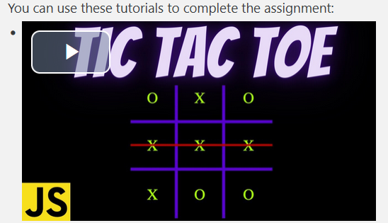

# Jane Doe - Terraform, EC2, TicTacToe report

- Course: *Cloud programming*
- Group: Thursday 13:15 - 15:00
- Date: 05.06.2024r.

## Environment architecture

Description and scheme of the developed infrastructure.
Before starting labs, I had to do adnotations to labs 5:

As a result I got repositories:

The whole solution is devided into modules (backend and frontend), to increase redability.
## Preview

Screenshots of configured AWS services. Screenshots of your application running.
ECR

Fargate:

## Reflections

What did you learn?
During this project, I learned how to configure various AWS services using Terraform. This includes creating and managing VPCs, subnets, internet gateways, route tables, security groups, and ECS clusters.

What obstacles did you overcome?
One of the significant obstacles I faced was configuring the ECS task definitions and services correctly. Initially, the tasks were not able to communicate properly due to misconfigured security group rules. Not properly set ports.

What helped you most in overcoming obstacles?
The most helpful resource in overcoming these obstacles was the detailed AWS documentation and the Terraform provider documentation.Also checking logs of partially deployed EC2's, and through trial and error, eventually solve the problem.

Was there something that surprised you?
I was surprised by the complexity and the number of dependencies involved in setting up a fully functional and secure environment for running containerized applications on AWS. However, once set up, the infrastructure is highly scalable and robust. That giving eventual link for frontend will be harder than for backend.

#Overall
In my opinion, the configuration of Fargate was easier, as it overall took less code. It is very important aspect in configuration. As the whole infrastructure is fragile, every minor mistake can take from 5 to 15 minutes (due to underlying prcesses of terraform apply and terraform destroy).
